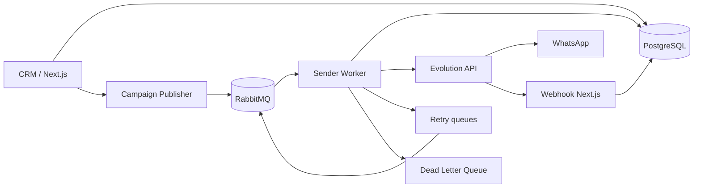

# SPEC v2 — Mensageria de campanhas com RabbitMQ

## 1. Problema

O disparo atual usa PostgreSQL como fila e executa um loop dentro do processo Next.js. O worker faz claim com `FOR UPDATE SKIP LOCKED`, chama Evolution e aguarda delays com `sleep()`. Isso mistura API web e trabalho de longa duração, dificulta escalabilidade e torna reinícios/deploys mais arriscados.

Para o volume atual, RabbitMQ não é necessário por throughput absoluto; ele é útil para **desacoplamento, previsibilidade, retry, isolamento de falhas e observabilidade**.

## 2. Objetivos

- retirar o processamento longo de campanhas do Next.js;
- preservar `Campaign`, `CampaignRun` e `CampaignContact`;
- manter Evolution API como provider;
- permitir retry controlado e DLQ;
- manter pause/resume/cancel;
- permitir crescimento para múltiplas instâncias;
- obter rastreabilidade ponta a ponta;
- reduzir latência causada pela arquitetura atual, sem remover controles legítimos de capacidade.

## 3. Não objetivos do MVP

- trocar Evolution API;
- reescrever painel de campanhas;
- migrar todas as mensagens de atendimento imediatamente;
- adicionar Kafka;
- criar plataforma multi-região;
- Redis;
- balanceador avançado entre dezenas de instâncias.

## 4. Arquitetura alvo do MVP

## 5. Fonte de verdade

O banco continua sendo a fonte de verdade:

- `CampaignRun.status` controla se um run pode continuar;
- `CampaignContact.status` representa o estado do destinatário;
- provider ID é persistido no contato e/ou Message;
- RabbitMQ não decide status de negócio sozinho.

## 6. Fluxo de envio

1. usuário inicia disparo;
2. `prepareCampaignRun()` cria/estende run e contatos;
3. publisher seleciona `CampaignContact.status=pending` do run;
4. publica um job por contato;
5. publisher marca `queuedAt` e `queueJobId` somente após publisher confirm;
6. worker recebe job;
7. valida schema;
8. verifica idempotência;
9. busca estado atual do contato/run/campanha/instância;
10. se run não estiver RUNNING, não envia;
11. revalida suppression;
12. escolhe instância elegível;
13. aplica política de capacidade;
14. chama Evolution;
15. em sucesso, persiste `sent/providerId/sentAt` e incrementa run;
16. ACK;
17. webhook atualiza delivered/read posteriormente.

## 7. Concorrência

MVP: `prefetch=1` por sender process. Para uma única instância WhatsApp, isso simplifica ordem e evita rajadas concorrentes.

Futuro: usar routing key por `instanceId` e múltiplos consumers, garantindo limite de concorrência por instância.

## 8. Rate limiting

A política não deve usar waits longos dentro do consumer. Quando um envio ainda não estiver liberado:

- rejeitar/republish para uma retry queue com TTL adequado; ou
- usar uma fila de delay/plugin somente se operacionalmente aprovado.

No MVP, criar buckets fixos de retry (ex. 5s, 30s, 2m, 10m). Para controles de capacidade de campanha, calcular `notBefore` e rotear para a retry apropriada.

## 9. Retry

Transitório:

- timeout;
- 429;
- 5xx;
- conexão Evolution indisponível;
- erro de rede.

Permanente:

- número inválido confirmado;
- opt-out/suppression;
- payload inválido;
- configuração inexistente que exige ação humana após limite de tentativas.

Máximo sugerido de tentativas técnicas: 5.

## 10. Idempotência

Usar `queueJobId` único por `CampaignContact` + versão lógica do envio. Um contato já `sent/delivered/read/skipped` não pode ser reenviado pelo mesmo job.

Se ocorrer crash após Evolution aceitar e antes do ACK, o job poderá ser reentregue. Mitigação:

- persistir providerId assim que receber resposta;
- consultar estado local antes de cada envio;
- quando provider oferecer idempotency key, adotá-la;
- registrar `processingAt` e `attemptCount`.

A arquitetura é **at-least-once**, com idempotência no consumidor.

## 11. Feature flag

`CAMPAIGN_QUEUE_DRIVER=legacy|rabbitmq`

- `legacy`: comportamento existente.
- `rabbitmq`: não chama `startCampaignWorker`; publica jobs.

Rollback é alterar ENV e reiniciar app/worker.

## 12. Critérios de aceite do MVP

- campanha de teste com 5 contatos processa sem loop/sleep no Next.js;
- reiniciar Next.js não interrompe jobs já publicados;
- reiniciar worker causa redelivery, sem duplicar envio conhecido;
- retry funciona para erro transitório;
- DLQ recebe falha final;
- pause impede novos envios mesmo com jobs já na fila;
- resume volta a processar;
- cancel impede envio posterior;
- opt-out é revalidado imediatamente antes de enviar;
- métricas básicas mostram queued, processing, sent, failed e retry;
- worker roda por PM2/systemd fora do Docker.
