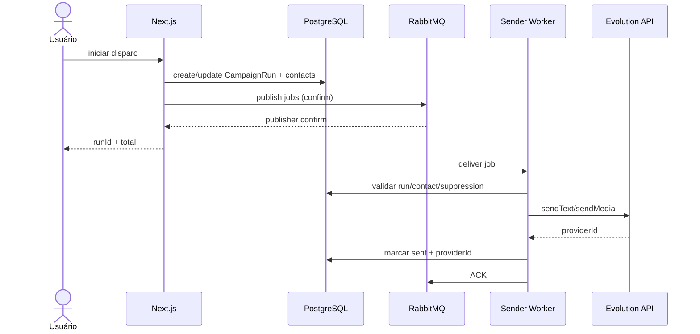

# Arquitetura

## Estado atual

```text
POST /api/broadcast
  -> prepareCampaignRun()
  -> CampaignRun + CampaignContact no Postgres
  -> executeCampaignRun()
  -> startCampaignWorker()
  -> loop dentro do processo Next.js
  -> claimNextJob() via FOR UPDATE SKIP LOCKED
  -> Evolution API
  -> sleep(delay)
```

Problemas: ciclo de vida acoplado ao Next.js, waits longos, capacidade limitada a um loop global por processo (`busy`), deploy/restart afeta trabalho, observabilidade fragmentada.

## Estado alvo MVP

```text
POST /api/broadcast
  -> prepareCampaignRun()
  -> publisher(confirm)
  -> RabbitMQ
  -> campaign-sender (PM2)
  -> transaction claim/idempotency
  -> Evolution API
  -> persist
  -> ACK
```

## Componentes

### CRM Next.js
Responsável por autenticação, UI, criação de campanhas, criação de runs, pause/resume/cancel e webhook.

### Publisher
Biblioteca dentro do CRM. Publicação é rápida e não faz envio.

### RabbitMQ
Entrega durável, retry, DLQ.

### Sender Worker
Processo Node separado. Executa a parte hoje contida em `processJob()` que é realmente relacionada ao envio.

### PostgreSQL
Fonte de verdade de negócio e idempotência.

### Evolution API
Provider existente, sem mudança de contrato no MVP.

## Diagrama de sequência



## Consistência

Não existe transação distribuída DB+RabbitMQ no MVP. A confiabilidade é obtida por:

1. criar contatos no DB;
2. publicar com confirm;
3. marcar `queuedAt` após confirm;
4. job reparador publica contatos `pending` sem `queuedAt`;
5. consumidor idempotente.

Para uma fase posterior, avaliar transactional outbox se houver necessidade real.
